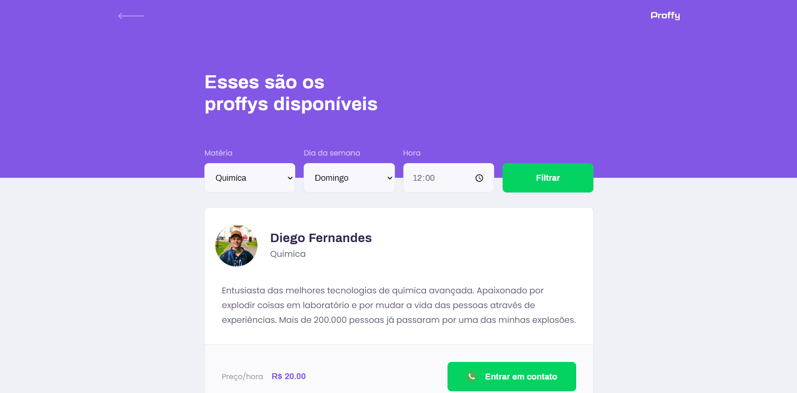
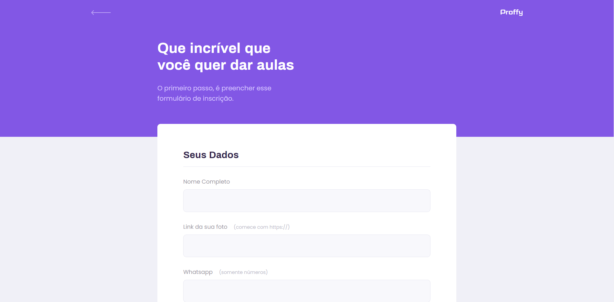

# Proffy Next Level Week

Proffy - a project developed during the Next Level Week #2 by <strong><a href="https://github.com/Rocketseat">@Rocketseat</a></strong> 🚀

<hr>

# Used Technologies

> - CSS
> - HTML
> - JavaScript
> - Node.js
> - Nunjucks
> - SQlite

<hr>

# Previews






<hr>

## Required tools:

``` bash
VScode
Node.Js
Git
```

## Install dependencies

```bash
npm install
```

## Run server (port 5500)

```bash
npm start
```

## URL (copy and paste in url bar)
```bash
http://127.0.0.1:5500
```

